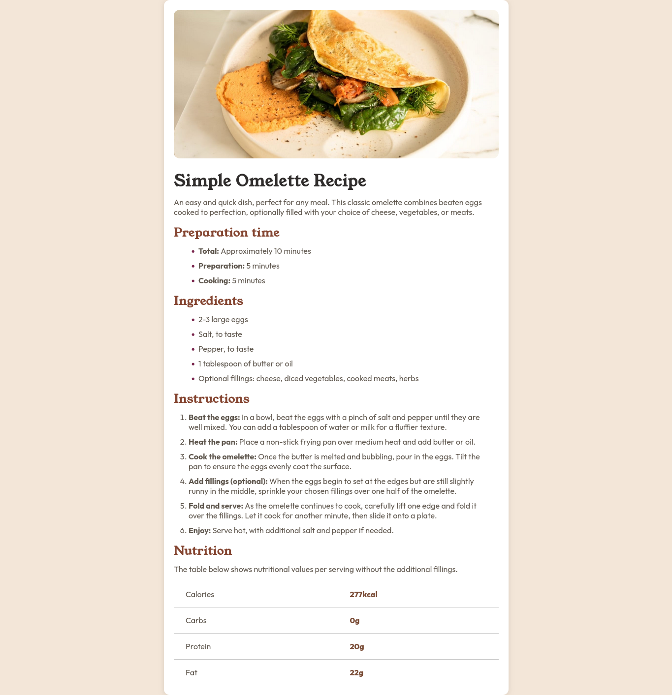

# Frontend Mentor - Recipe page solution

## Visão Geral do Projeto

### Captura de Tela

### Links

- URL do github : [Link para a solução no github](https://github.com/PedroReves/Recipe-Page)
- URL do site: [Link para o site da solução](https://pedroreves.github.io/Recipe-Page/)

## Processo de Construção

### Criado com

- Semantic HTML5 Tags
- Propriedades Customizadas CSS 
- Flexbox
- Propriedades Root

### O que eu aprendi

Esse está sendo um dos primeiros projetos que eu estou fazendo do frontend mentor, eu ainda preciso melhorar bastante os conhecimentos de html e css, pois tive dificuldade em construir algumas partes do projeto. Mas no geral, para começar esse foi um bom projeto

### Desenvolvimento Continuo

Quero ainda terminar esse projeto, colocar uma boa responsividade, conseguir terminar as partes em que eu tive duvida, refatorar o meu código, pois em algumas partes meu código css e html não está semântico, entre outras coisas.

## Autor

- Frontend Mentor - [@PedroReves](https://www.frontendmentor.io/profile/PedroReves)

## Para quem quiser fazer

Para um projeto inicial, onde você queira trabalhar mais as suas habilidades html e css, esse é um projeto bom, mas ainda sim você vai passar um pouco de dificuldade com algumas coisas específicas.  
